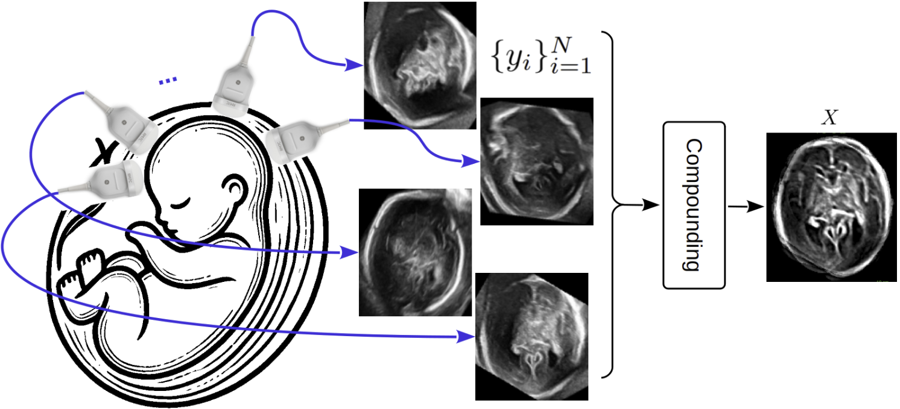

# USFetal: Tools for Fetal Brain Ultrasound Compounding

[](LICENSE)

---

## Overview

**USFetal** is an open-source toolbox designed for **fetal brain ultrasound compounding**. It integrates a variety of techniques to combine multiple 3D ultrasound volumes of the fetal brain into a single, high-quality volumetric representation.

The toolbox is designed to support research, evaluation, and benchmarking of different compounding strategies under a unified and configurable framework.

### Supported Techniques

#### Traditional Methods
- **Multi-scale** (e.g., Difference of Gaussians – DoG)  
- **Transformation-based** (e.g., Principal Component Analysis – PCA, Independent Component Analysis – ICA)  
- **Variational** (e.g., optimization-based methods and Total Variation (TV) regularization)

#### Deep Learning Methods
- **Self-Supervised Learning (SSL)** – Scan-specific training approach that leverages complementary information across views.
- **Plug-and-Play (PnP)** – A training-free framework that integrates learned priors into the compounding process.


<p align="center">
  
</p>

---


##  Installation

Follow the steps below to set up the environment and run the toolbox.  
Tested on **Ubuntu 22.04**, **Python 3.9**, and **CUDA 12.4**.

###  1) Clone the repository
```
git clone https://github.com/mkhateri/USFetal-Compounding-Tools.git
cd USFetal-Compounding-Tools
cd USFetal
```

###  2) Create and activate the Conda environment
```bash
conda env create -f environment.yml
conda activate USFetal
```

###  3) Explicit `PYTHONPATH` step
```bash
export PYTHONPATH=$(pwd):$PYTHONPATH
```
---

##  Data Structure

Each subject folder inside the dataset (e.g., `data/`) contains multiple 3D ultrasound volumes and their corresponding (optional) binary brain masks.
Each volume–mask pair (e.g., view1) corresponds to a distinct acquisition view of the same subject.

```bash
data/
├── subject_01/{volumes/, masks/}
│   ├── volumes: view1.nii.gz, view2.nii.gz, …, viewN.nii.gz
│   └── masks:   view1.nii.gz, view2.nii.gz, …, viewN.nii.gz
├── subject_02/{volumes/, masks/}
│   ├── volumes: view1.nii.gz, view2.nii.gz, …, viewM.nii.gz
│   └── masks:   view1.nii.gz, view2.nii.gz, …, viewM.nii.gz
└── ...

```

---
### Usage
Each subdirectory provides scripts and configuration files for running a specific framework:
```bash
USFetal/
  ├── configs/              # Configuration files
  ├── evaluation/           # Image quality assessment
  ├── traditional/          # Classical compounding methods
  ├── ssl_scan_specific/    # Scan-specific self-supervised learning framework
  └── pnp/                  # Plug-and-play compounding
```


Users can either:

  **-Edit configuration files in configs/, or**
  
  **-Override parameters directly from the command line.**


#### Traditional Methods 
Run classical compounding methods using a configuration file:
```
python traditional/main.py \
            --methods pca:standard ica:patchwise variational:dog
```

Override data paths and key parameters from the command line:
```
python traditional/main.py \
  --methods pca:patchwise \
  --data_parent ./data \
  --output_dir ./output_traditional \
  --patch_size 96 96 96 \
  --overlap 48 48 48

```

#### Self-Supervised Learning (SSL)

The SSL framework supports scan-specific self-supervised training and inference.
```
python ssl_scan_specific/scripts/train.py 

```
During training:

• The full configuration is saved to the experiment directory

• The best, last, and interval-based model checkpoints are stored automatically


Run inference

```
python ssl_scan_specific/scripts/inference.py 
```

During inference:

• The trained model checkpoint is loaded automatically

• Model architecture and parameters are recovered from the training experiment


#### Plug-and-Play (PnP) Framework

Before running the PnP framework, download the pretrained denoiser models from the model zoo:
```
python pnp/main_download_pretrained_model.py
```
This script automatically downloads and prepares the required pretrained denoisers.
You can then use the default configuration from configs/config_pnp.py:
```
python pnp/main.py
```

Or specify paths and parameters directly from the command line:
```
python pnp/pnp.py \
  --data_parent ./data \
  --output_dir ./output_pnp \
  --iter_num 10
```

## Image Quality Assessment

The evaluation module computes quantitative metrics (e.g., SSIM, PSNR, CC, MI, Entropy) for both the input views and the compounded volumes.

It accepts the path to:

• The parent data folder containing input views and masks  

• The output directory containing compounded results


```
python evaluation/iq_assess.py \
  --parent_data <parent_data> \
  --output_dir <output_dir>
```
The output_dir format is as follows:
```
output/
├── subject_01/
│   ├── subject_01_pnp.nii.gz
│   ├── subject_01_pca.nii.gz
│   ├── subject_01_ssl.nii.gz
│   └── ...
├── subject_02/
│   ├── subject_02_pnp.nii.gz
│   ├── subject_02_pca.nii.gz
│   ├── subject_02_ssl.nii.gz
│   └── ...
└── ...
```
Results are automatically saved under <output_dir> with .csv, .tex, and .txt formats.

---
##  Citation


🙏 If you find this toolbox useful in your work, please cite:

```bibtex
@article{khateri2026usfetal,
  title={USFetal: Tools for Fetal Brain Ultrasound Compounding},
  author={Khateri, Mohammad and Ghahremani, Morteza and Valencia, Sergio and Jaimes, Camilo and Sierra, Alejandra and Tohka, Jussi and Grant, P Ellen and Karimi, Davood},
  journal={arXiv preprint arXiv:2601.06726},
  year={2026}
}
```

---
## Acknowledgments

The PnP compounding implementation adapted from [Deep Plug-and-Play Image Restoration](https://ieeexplore.ieee.org/abstract/document/9454311) by Zhang *et al.* We gratefully acknowledge the authors and the [DPIR repository](https://github.com/cszn/DPIR).


